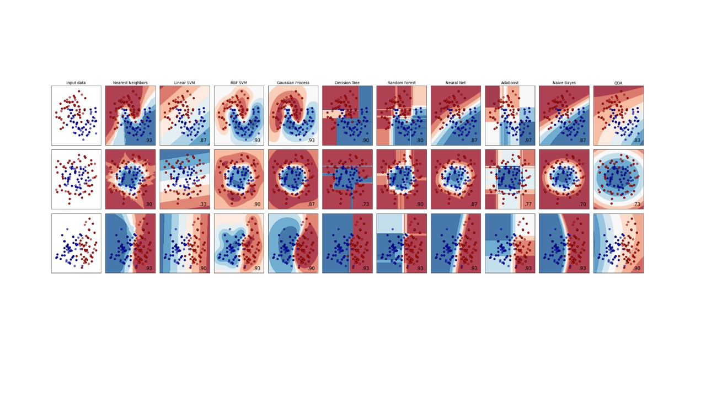
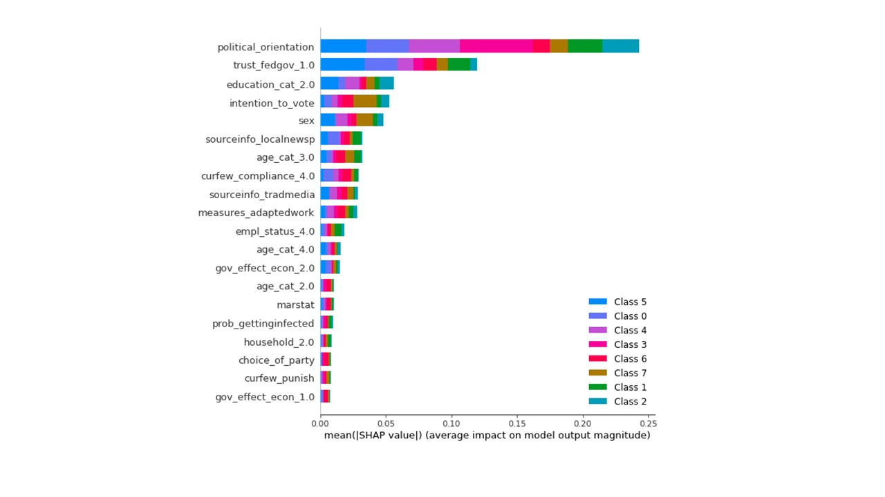
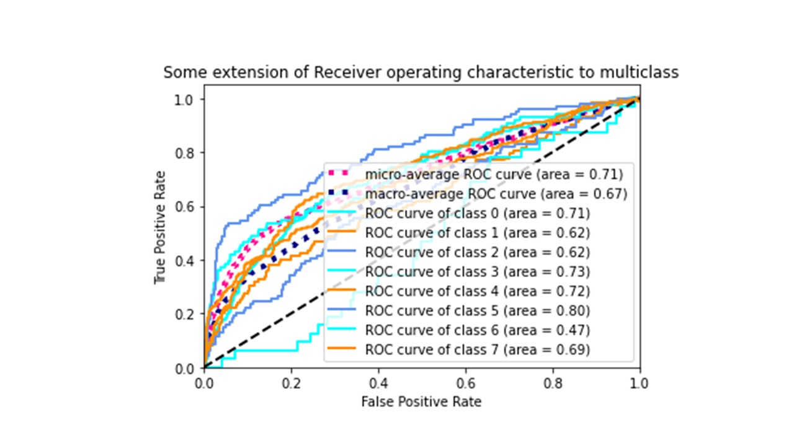

# COVID Measures and Voting Behavior in Germany

The project is about understanding the impact of the corona virus on voting behavior in Germany. 
The variables include citizens' risk perception, evaluation of political measures, trust in the federal government, and media consumption. 
Data is publicly available at [https://search.gesis.org/research_data/ZA5667?doi=10.4232/1.13520](https://search.gesis.org/research_data/ZA5667?doi=10.4232/1.13520))
My multi-class analysis includes EDA, and finding the best predictive model for the choice of political party.
The plot shows training points in solid colors and testing points semi-transparent. The lower right shows the classification accuracy on the test set.

Feature importances indicated by the SHAP value reveal that political orientation is still the most influential feature regardless of the COVID outbreak. The citizens' perceptions on the government policies, the COVID measures and media exposure are mainly shaped by the political orientation, which in return influence the voting behavior. Interestingly, the  COVID-related features have a higher influence on far-right (Afd) or far-left(Die Linke) tparty choices than the political parties at the center (CDU/CSU).

The ROC-Curve indicates the overall performance of the classification model at all classes.

